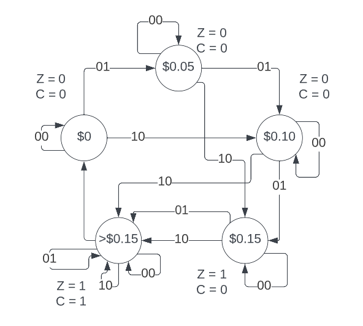
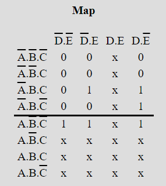

Department of Engineering, ORU
CMPE 340: Digital Systems Design

# Project Description
The purpose of this project is the design of the hardware for a very simple vending machine. The machine is designed to take inputs in the form of nickels and dimes. Once a certain amount of money has been inserted (equivalent to fifteen cents), it will output candy. If more money than necessary has been inserted, the machine will also provide change. 
The project had specific requirements, including the use of only nickel and dime inputs (represented by two switches on an FPGA), and the output of candy when the circuit received a total of fifteen cents. If more than fifteen cents were inserted, the machine would also provide change. The machine was created using a combination of Moore machines amd D-flipflops, as well as OR and AND gates.

# Design and Approaches

When the project was assigned, two options for implementing the circuit were presented: Mealy or Moore machines. Each have its own advantages and disadvantages. The Mealy Machine is faster, but since it changes based on state transition, it is prone to errors when the state is unstable. In contrast, the Moore Machine is slower but more consistent, as it only changes based on the current state. Due to the complexity of the circuit, the Moore Machine was chosen to ensure stability.

The circuit has several different states based on the inputs, such as a nickel or a dime. Even within the fifteen-cent range specified for the project, there are many states that need to be covered. These states are represented by LEDs on the breadboard. When a dime is inserted, a certain state is represented by an LED lit to represent a one or zero value. When a coins are inserted, the LED reflects a value of zero or one, with each input adding a different value until the correct state is reached, indicated by the LED for candy output lighting up.

# FSM Derivations, Truth Table, and K-Maps

State Transition Diagram

# Truth Table

| **Nickel** | **Dime** | **QA** | **QB** | **QC** | **QA­+** | **QB­+** | **QC­+** | **Z** | **Change** |
| ----------------------------------------- | --------------------------------------- | ------------------------------------------------ | ------------------------------------------------ | ------------------------------------------------ | ------------------------------------------------------------- | ------------------------------------------------------------- | ------------------------------------------------------------- | ------------------------------------ | ----------------------------------------- |
| **A**      | **B**    | **C**             | **D**             | **E**             |                                                               |                                                               |                                                               |                                      |                                           |
| 0                                         | 0                                       | 0                                                | 0                                                | 0                                                | 0                                                             | 0                                                             | 0                                                             | 0                                    | 0                                         |
| 0                                         | 0                                       | 0                                                | 0                                                | 1                                                | 0                                                             | 0                                                             | 1                                                             | 0                                    | 0                                         |
| 0                                         | 0                                       | 0                                                | 1                                                | 0                                                | 0                                                             | 1                                                             | 0                                                             | 0                                    | 0                                         |
| 0                                         | 0                                       | 0                                                | 1                                                | 1                                                | 0                                                             | 1                                                             | 1                                                             | 1                                    | 0                                         |
| 0                                         | 0                                       | 1                                                | 0                                                | 0                                                | 1                                                             | 0                                                             | 0                                                             | 1                                    | 1                                         |
| 0                                         | 0                                       | 1                                                | 0                                                | 1                                                | 1                                                             | 0                                                             | 0                                                             | 1                                    | 1                                         |
| 0                                         | 0                                       | 1                                                | 1                                                | 0                                                | 1                                                             | 0                                                             | 0                                                             | 1                                    | 1                                         |
| 0                                         | 0                                       | 1                                                | 1                                                | 1                                                | 1                                                             | 0                                                             | 0                                                             | 1                                    | 1                                         |
| 0                                         | 1                                       | 0                                                | 0                                                | 0                                                | 0                                                             | 0                                                             | 1                                                             | 0                                    | 0                                         |
| 0                                         | 1                                       | 0                                                | 0                                                | 1                                                | 0                                                             | 1                                                             | 0                                                             | 0                                    | 0                                         |
| 0                                         | 1                                       | 0                                                | 1                                                | 0                                                | 0                                                             | 1                                                             | 1                                                             | 0                                    | 0                                         |
| 0                                         | 1                                       | 0                                                | 1                                                | 1                                                | 1                                                             | 0                                                             | 0                                                             | 1                                    | 0                                         |
| 0                                         | 1                                       | 1                                                | 0                                                | 0                                                | 1                                                             | 0                                                             | 0                                                             | 1                                    | 1                                         |
| 0                                         | 1                                       | 1                                                | 0                                                | 1                                                | 1                                                             | 0                                                             | 0                                                             | 1                                    | 1                                         |
| 0                                         | 1                                       | 1                                                | 1                                                | 0                                                | 1                                                             | 0                                                             | 0                                                             | 1                                    | 1                                         |
| 0                                         | 1                                       | 1                                                | 1                                                | 1                                                | 1                                                             | 0                                                             | 0                                                             | 1                                    | 1                                         |
| 1                                         | 0                                       | 0                                                | 0                                                | 0                                                | 0                                                             | 1                                                             | 0                                                             | 0                                    | 0                                         |
| 1                                         | 0                                       | 0                                                | 0                                                | 1                                                | 0                                                             | 1                                                             | 1                                                             | 0                                    | 0                                         |
| 1                                         | 0                                       | 0                                                | 1                                                | 0                                                | 1                                                             | 0                                                             | 0                                                             | 0                                    | 0                                         |
| 1                                         | 0                                       | 0                                                | 1                                                | 1                                                | 1                                                             | 0                                                             | 0                                                             | 1                                    | 0                                         |
| 1                                         | 0                                       | 1                                                | 0                                                | 0                                                | 1                                                             | 0                                                             | 0                                                             | 1                                    | 1                                         |
| 1                                         | 0                                       | 1                                                | 0                                                | 1                                                | 1                                                             | 0                                                             | 0                                                             | 1                                    | 1                                         |
| 1                                         | 0                                       | 1                                                | 1                                                | 0                                                | 1                                                             | 0                                                             | 0                                                             | 1                                    | 1                                         |
| 1                                         | 0                                       | 1                                                | 1                                                | 1                                                | 1                                                             | 0                                                             | 0                                                             | 1                                    | 1                                         |
| 1                                         | 1                                       | 0                                                | 0                                                | 0                                                | X                                                             | X                                                             | X                                                             | X                                    | X                                         |
| 1                                         | 1                                       | 0                                                | 0                                                | 1                                                | X                                                             | X                                                             | X                                                             | X                                    | X                                         |
| 1                                         | 1                                       | 0                                                | 1                                                | 0                                                | X                                                             | X                                                             | X                                                             | X                                    | X                                         |
| 1                                         | 1                                       | 0                                                | 1                                                | 1                                                | X                                                             | X                                                             | X                                                             | X                                    | X                                         |
| 1                                         | 1                                       | 1                                                | 0                                                | 0                                                | X                                                             | X                                                             | X                                                             | X                                    | X                                         |
| 1                                         | 1                                       | 1                                                | 0                                                | 1                                                | X                                                             | X                                                             | X                                                             | X                                    | X                                         |
| 1                                         | 1                                       | 1                                                | 1                                                | 0                                                | X                                                             | X                                                             | X                                                             | X                                    | X                                         |
| 1                                         | 1                                       | 1                                                | 1                                                | 1                                                | X                                                             | X                                                             | X                                                             | X                                    | X                                         |

# K-Maps

From the truth table, the following K-maps were derived:

1.  **QA­+**

> 
> 
> QA­+ = A + BD + BCE

2.  **QB­+**

> 
> 
> QB­+ = BC'D' + A'B'C'D + B'C'DE' + AC'D'E

3.  **QC+**

> 
> 
> QC+­ = AC'E' + A'B'C'E + A'C'D'E

4.  **Z**

> 
> 
> Z = C + DE

5.  **Change**

> 
> 
> Change = C

# Circuit Implementation and Results

## Design Constraints

As previously mentioned, this circuit had multiple constraints. The first was the need for a nickel input, and the second was the need for a separate dime input. These constraints were critical, and a Moore Machine was designed to meet them. The machine required three D-flipflops, three 4-input AND gates, a 3-input AND gate, a 2-input AND gate, and two 3-input OR gates, in accordance with the constraints of the machine being built.

## Testing

The circuit initially produced incorrect results despite having implemented the diagram, wiring, and chips as intended. Several instances of incorrect states were observed, including the system working only for the first rising edge, but changing to a completely wrong state upon the second rising edge. Testing revealed that the D-flipflop was the culprit, outputting wrong values for the state. Replacing it with a different D-flipflop did not solve the problem, so the circuit was tested without the flipflops to confirm that the problem was related to them. The circuit was correct without the flipflops, so it was apparent that they were the issue. Testing two new D-flipflops before implementing them into the circuit showed that they were functional, but they output the wrong states once they were connected. After thorough troubleshooting, it was determined that the clock was the issue. As a mechanical switch was being used to manually control the clock, it came to light the switch bounced when it was flipped, causing the clock to undergo several rising and falling edges extremely fast. It was resolved by replacing the switch clock with an onboard clock that oscillated automatically. With this problem solved, the project was finally completed to meet the initial conditions and produce the desired results.

# Summary

This project had various benefits, including the opportunity to witness
the result of an entire semester's worth of work put into practice in a
device that is commonly used in modern life. In addition, it highlighted
the importance of connecting a device's clock to the built-in clock to
minimize noise in the circuit, which can be beneficial for future
projects. Despite encountering several implementation issues, such as
incorrect states and the need to replace multiple chips, these problems
were ultimately overcome through careful checking of every component of
the circuit.

The biggest benefit of this project was the opportunity to learn how to
design a digital system from initial concept to gate level hardware.
Topics such as finite state machines, flip-flops, and K-maps were
cemented in the learning process by completing this project.
